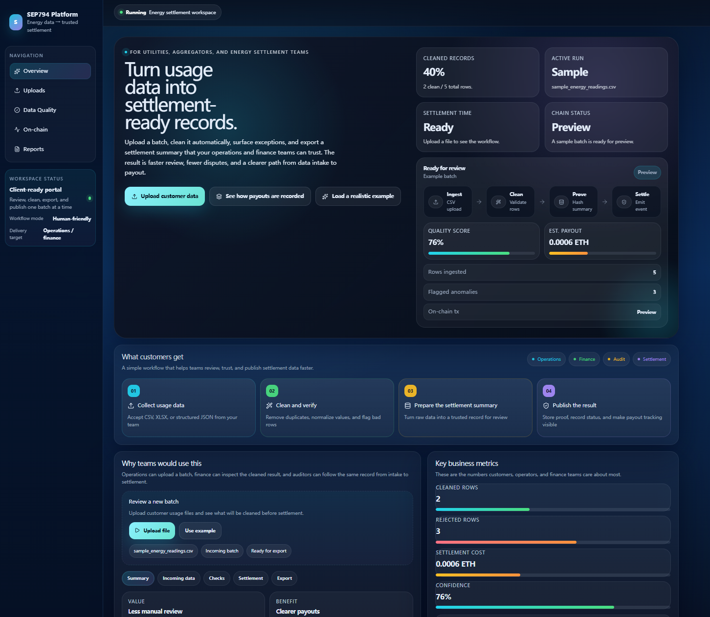

# AI-assisted Energy Data Validation Platform

> 🚧 **Project Status:** Work in Progress (Graduate Innovation Project)

---

## Overview

This repository documents an ongoing graduate innovation project developed during the SEP790 / SEP794 courses in the Master of Engineering Entrepreneurship & Innovation (MEEI) program at McMaster University.

The project explores how Artificial Intelligence, Engineering Data Analytics, and Trusted Digital Technologies can work together to improve the quality, reliability, and traceability of engineering data.

Rather than focusing solely on AI, the project investigates an integrated workflow combining intelligent data validation, automated technical documentation, engineering analytics, and future blockchain-enabled verification.

---

# Project Vision

The long-term goal is to develop an intelligent engineering platform capable of:

- AI-assisted engineering data validation
- Automated technical documentation
- Engineering workflow automation
- Intelligent reporting
- Trusted data verification
- Future blockchain integration for engineering traceability

---

# Current Development Status

The project is currently under active development.

Completed:

- AI-assisted validation workflow design
- Prototype engineering dashboard
- Python-based data validation prototype
- Engineering analytics framework
- System architecture design

In Progress:

- Validation algorithms
- Workflow optimization
- AI-assisted documentation

Planned:

- Blockchain verification
- Chainlink oracle integration
- Smart contract automation
- Real-time engineering dashboard

---

# System Workflow

The current prototype workflow is illustrated below.


The proposed platform follows these major stages:

1. Energy data collection from engineering systems
2. Python-based data validation and preprocessing
3. Oracle-based trusted verification
4. Blockchain record generation for traceability
5. Settlement and downstream engineering applications

---
# Prototype Dashboard

Current dashboard prototype:



The dashboard demonstrates how engineering data can be monitored and validated using interactive visualizations before entering the verification process.

---

# Technology Stack

## Artificial Intelligence

- Hermes AI Agent
- ChatGPT
- Claude
- Gemini

## Data Analytics

- Python
- Power BI
- Power Query
- DAX

## Future Technologies

- Blockchain
- Chainlink
- Smart Contracts
- Oracle Integration

---

# Repository Structure

```
ai-energy-data-validation

│
├── README.md
│
├── images
│   ├── Project workflow.png
│   ├── dashboard.png
│   ├── data rinsing programming.png
│   └── data rinsing programming2.png
│
└── source code
```

---

# Future Roadmap

Future development will focus on:

- AI-driven anomaly detection
- Automated engineering report generation
- Intelligent validation workflows
- Blockchain-based engineering data verification
- Chainlink oracle integration
- Smart contract automation
- Digital engineering audit trail

---

# About

This repository represents an ongoing graduate innovation project completed as part of the Master of Engineering Entrepreneurship & Innovation (MEEI) program at McMaster University.

The project serves as a prototype for exploring the application of Artificial Intelligence, Engineering Analytics, Workflow Automation, and Trusted Digital Technologies in future engineering systems.
